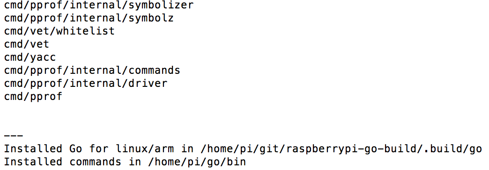

# raspberrypi-go-build
Golang build on Raspberry Pi

Bootstrap file  and parts of code taken from http://dave.cheney.net/2015/09/04/building-go-1-5-on-the-raspberry-pi

## Installation

git clone https://github.com/adamwalach/raspberrypi-go-build.git

## Usage

Setup your environment - https://golang.org/doc/code.html#GOPATH

Modify build.sh - set version of Golang you want to install (GO_VERSION variable).

After succesful compilation (it can take a while - up to 1 hour) you should see a message like this:

It means your new and shiny golang compiler is ready to do some work

## Tested on

 * Raspberry Pi 2 - go1.5.3, go1.6

